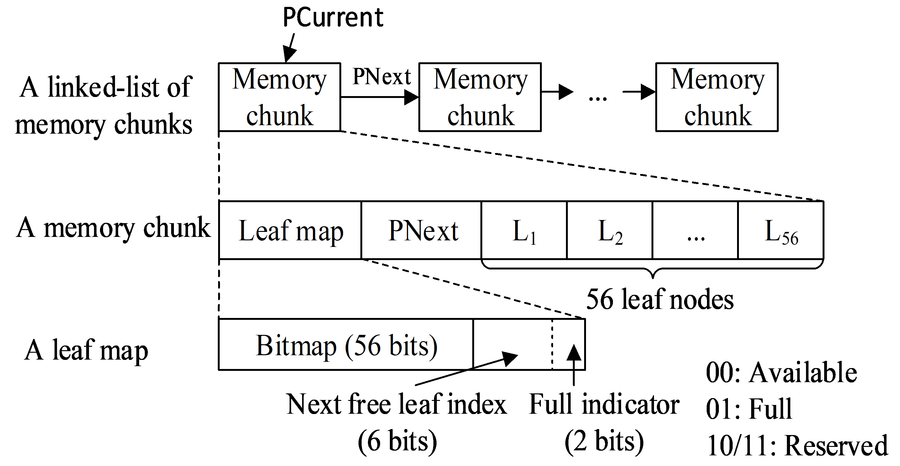
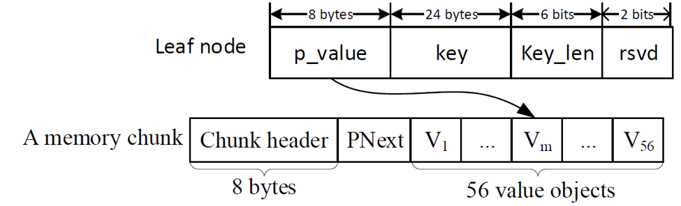

<!DOCTYPE html> <html lang="zh"> <head> <meta charset="utf-8"/> <link rel="shortcut icon" href="https://www.mdeditor.com/images/logos/favicon.ico" type="image/x-icon"/> </head> <body><h1 id="h1-dram-pm-">DRAM和PM混合系统上设计并发访问的哈希辅助基数树</h1><h2 id="h2--radix-tree-amp-adaptive-radix-tree-art-">基数树（Radix Tree）&amp;自适应基数树（Adaptive Radix Tree，ART）</h2><ul> <li>基数树<ul> <li>所有内部节点大小相同 </li></ul> </li><li>自适应基数树<ul> <li>根据子节点数量的不同使用几种不同大小内部节点</li><li>当一个内部节点的父节点只有一个子节点时进行路径压缩 </li></ul> </li></ul> <table> <thead> <tr> <th></th> <th>B树/B+树变种</th> <th>基数树变种</th> </tr> </thead> <tbody> <tr> <td>纯PM</td> <td>CDDS B Tree、NV-Tree</td> <td>WORT、WOART</td> </tr> <tr> <td>DRAM、PM混合</td> <td>FPTree</td> <td>HART</td> </tr> </tbody> </table> 
对于持久性B树/B+树来说 <strong>性能：有序键值&gt;无序键值</strong> <strong>一致性开销：有序键值&lt;无序键值</strong> <strong>基数树不存在这个问题：用键存放的位置表示键的值</strong>
 <h2 id="h2-hart-">HART总结</h2><ul> <li>hash辅助的ART</li><li>选择性持久化</li><li>并发访问</li><li>增强的内存分配器</li><li>支持不同大小的内部节点</li><li>防止内存泄漏</li></ul> <h2 id="h2-u8BBEu8BA1u65B9u6CD5">设计方法</h2><h3 id="h3-1-hash-">1.hash和自适应基数树结合</h3><ul> <li>使用hash表管理ART，每一个hash值对应一个ART</li><li>每个键分为两部分：hash部分和ART部分 </li></ul> <h3 id="h3-2-">2.选择性持久化</h3><ul> <li>hash表和ART的内部节点存储在DRAM（<strong>DRAM的性能+有序的键值+无一致性开销</strong>）</li><li>叶子节点放在PM上，完整的key也放在叶子节点中，便于一致性恢复</li></ul> <h3 id="h3-3-">3.并发访问</h3><ul> <li>树粒度的锁，最高并行度为树的个数</li></ul> <h3 id="h3-4-">4.增强的内存分配器</h3><ul> <li>单独实现一个内存分配器，一次性申请多个叶子或者值的节点，提高申请效率</li><li>使用位示图表示节点是否使用</li><li>把记录下一个叶子或者值节点的信息放在申请的memory chunk中，为崩溃一致性恢复提供保障，减少性能开销</li><li>只有当叶子节点成功插入到书中时，位示才会更改，能够防止内存泄漏  </li></ul> <h2 id="h2-u7B97u6CD5">算法</h2><h3 id="h3-u63D2u5165u7B97u6CD5">插入算法</h3><ol> <li>把键值分成hash部分和和ART部分，根据hash部分找到对应的ART树</li><li>使用增强的分配器为叶节点和值节点申请PM空间</li><li>更新值节点，<strong>持久化值节点</strong></li><li>把叶子节点指向值节点，<strong>持久化叶子节点</strong></li><li>更改值节点的位示图</li><li>更新叶子节点的key，并将其持久化</li><li>把叶子结点插入到ART中</li><li>更改叶子节点的位示图</li></ol> <h3 id="h3-u5D29u6E83u6062u590D">崩溃恢复</h3>
1.插入开始
 <ul> <li>更改值节点</li><li>更改叶子节点指针</li></ul> 
<strong>2.设置值的位示图</strong>
 <ul> <li>设置叶子节点key值</li></ul> 
<strong>3.插入到ART中</strong> <strong>4.设置叶子节点位示图</strong> 5.插入结束 

崩溃发生在2之前：无需额外操作 崩溃发生在2-3之间，下次调用增强的持久内存分配器时会自动检测修复不一致状态 崩溃发生在3-4之间，下次调用查找函数会修复不一致状态 
<h2 id="h2-github-">github开源代码链接</h2>
<a href="https://github.com/CASL-SDSU/HART">https://github.com/CASL-SDSU/HART</a>
 </body> </html>
